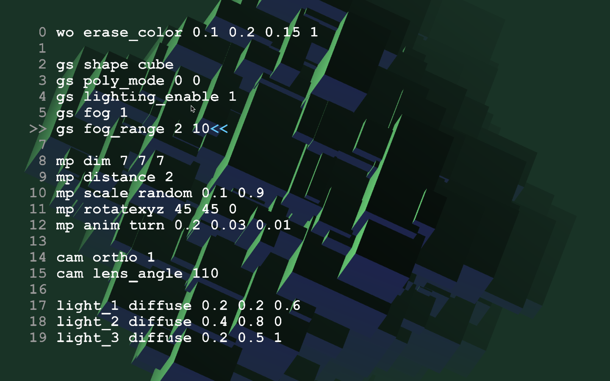

# th.gl.texteditor

#### [More visuals and code!](http://gumroad.com/tmhglnd)

#### [Become a Patron!](https://www.patreon.com/bePatron?u=9649817)

---

A basic texteditor in the Max Jitter OpenGL window for interaction with your patch in a Livecoding-like style.



## About

Live coding is starting to become more and more popular. As a new form of performance, as a way of showing transparency to the audience in what you are doing, as a challenge for the performer to come up with interesting code on the fly and as a way of exploring the computer, creative coding and improvisation. Because coding entirely from scratch is a hard task, it can be helpful to prepare some code beforehand, and then perform with that on stage by for example adjusting parameters. This text editor lets you achieve just that! Build your entire audio/visual performance in max, and use the text-editor to live code parameters in your patch and send commands.

This is a basic text editor for the opengl world of Max build in javascript. Add the object to your setup and initialize it with the name of the render context and dimensions for the context. Then make sure you send it the render bang in the top inlet. The outlet outputs the typed text as a list of per-line symbols ready for parsing in any way you like. For example control parameters of gl objects, control musical parameters, lighting shows, just use it as a typewriter or whatever you think of!

## Install

Download zip
```
1. download zip
2. unzip and place in Max Searchpath (eg. MacOS ~/Documents/Max 8/Library)
3. restart Max8
```
Git clone
```
1. $ cd ~/Documents/Max\ 8/Library
2. $ git clone https://github.com/tmhglnd/th.gl.texteditor.git
3. restart Max8
```
```
4. Create a new object with "n" and type th.gl.texteditor. (Alt) + Right-click to open the helpfile.
5. Read the helpfile carefully, open the Big Example to play with some of the jit.gl objects
```
## License

The GNU Lesser General Public License v.3

The artistic and aesthetic output of the software in the examples is licensed under:
Creative Commons Attribution-ShareAlike 4.0 International License

(c) Timo Hoogland 2020